Many enterprises are moving from batch to streaming data processing. This engineering innovation provides great improvements to many enterprise data pipelines, both on the primary processes such as front-facing services and core operations, as well as on secondary processes such as chain monitoring and operational risk management.  

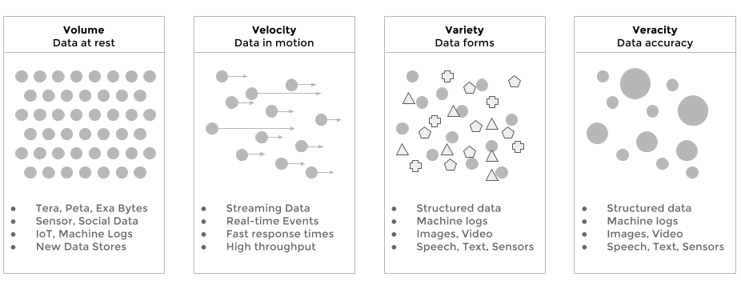

Streaming Analytics is the evolution of Big Data, where data throughput (velocity) and low-latency are important business KPIs. In such systems, data signals are ingested and produced at high speed  - often in the range of millions of events per seconds. On top of that, the system has still to operate on large volumes of heterogeneous resources, it must execute complex processing to verify the completeness and accuracy of data. Finally, the produced output and data transformation must be produced fast enough to be relevant and actionable.

**Batch vs Streaming**

A batch chain is normally a series of transformations which happen sequentially, from source data to final results. Data moves one batch at a time from one step to the next one. Batch systems usually rely on schedulers to trigger the next step(s) in the pipeline, depending on the status of the previous step.  

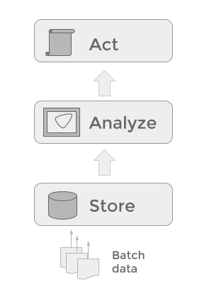

This approach suffers from a number of limitations:

*   It usually introduces unnecessary latency from the moment the initial data is  provided to the moment the results are produced. If those produced results were in fact insights, they might lose their "actionable" power because it is already too late to act.
*   Responses and results are delivered after the facts, and the only analysis which can be done is a retrospective analysis, but it's too late to steer or correct the system, or to avoid the incidents in the pipeline.
*   Decisions are made on results from aged or stale data, and they might be incorrect as the result do not reflect any longer the state of the system. This could produce over- and under- steering of the system.
*   Data is at rest. This is not necessarily a drawback, but batch system tend to be passive, with time spent in extracting and loading data from file systems to databases and back with peaks and congestion on the enterprise network rather than a continuous flow of data.

**A queue-centric approach to data processing**

From 10'000 feet high, a streaming analytics system can best be described as a queue. This logical, distributed queue connects agents producing data to those consuming data. Many components can functions both as sources and sinks for data streams. By highlighting the queue rather than the processing, we stress the fact that data is flowing, and data processing is always interleaved data transfer.

The same data element on the queue can potentially be required by many consumers. The pattern that best describe this is the publisher/subscriber pattern.

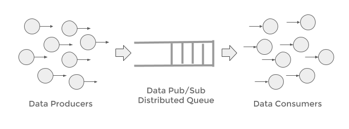

As the data transiting on the queue can be consumed at different rates, such a queue should also provide a certain persistence, acting as a buffer while producers and consumers are free to access data independently the one from the other.

**Streaming Analytics: Definition**

Here below a number of definitions which are widely accepted in the industry:

"Continuous processing on unbounded tables" - [Apache Flink](https://flink.apache.org/), [Data Artisans](http://data-artisans.com/)

"Software that can filter, aggregate, enrich and analyze a high throughput of data from multiple disparate live data sources and in any data format to identify simple and complex patterns to visualize business in real-time, detect urgent situations, and automate immediate actions" - [Forrester](https://go.forrester.com/)

Streaming Analytics provides the following advantages w.r.t batch processing: 

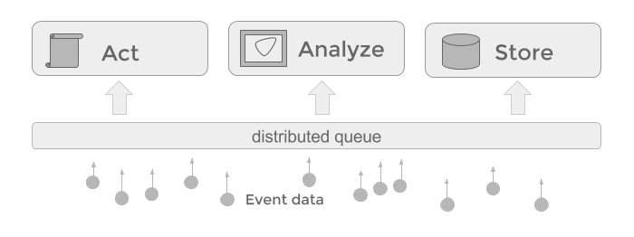

*   Events are analyzed and processed in real-time as they arrive
*   Decisions are timely, contextual, and based on fresh data
*   The latency from raw events to actionable insights in small
*   Data is in motion and flows through the architecture

Furthermore, batch processing can be easily implemented on streaming computing architectures, by simply scanning the files or datasets. The opposite is not always possible, because the latency and processing overhead of batch systems is usually not negligible when handling small batches or single events.

**Streaming Analytics: Events Streams vs Micro-Batches**

Next to latency and throughput, another important parameter which defines a streaming analytics system is the granularity of processing. If the system handles streams one event at a time, we define it as an event-based streaming architecture, if the streams gets consumed in packets/groups of events we call it a micro-batching streaming architecture. In fact you could consider a batch pipeline a streaming architecture, albeit a very slow one, handling the streaming data in very large chunks!

The following two pictures give an intuition of how those two paradigms work:

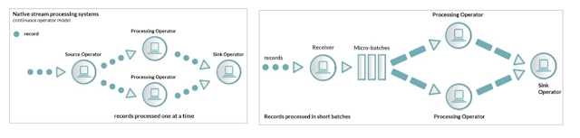

**Why Streaming Analytics for Chain Monitoring**

Enterprise BI processing chains tend to be very complex, because of the volume, but also because of the number of regulations and compliance measures taken. Hence it's not uncommon that process changes and unforeseen load can strain part of the chain, with oftentimes big consequences. When incidents occur several steps if not of the entire chain must be re-run. These incidents are often a source of delays, reduced service level and in general lower quality of internal BI process measures and KPIs.

Streaming Analytics can be effectively used as the processing paradigm to control and act on metadata produced by BI chains:

1.  Build models using a large amount of sensor meta-data, events, and facts, and determine which patterns are normal and which are anomalous in the received data

2.  Score, forecast and predict trends on newly generated data, and provide real-time actionable insights

**Use ETL logs and meta-data to forecast data quality and process operational kpi's**

*   Forecasting for Time, Volume, Query Types
*   Forecasting on Errors and Incidents

_Rationale:_

Data values tend to be stable around some statistics, therefore we could collect the logs and build a model complying on the statistics of incidents, and other monitors values in order to determine the chance of success of a given ETL pipeline.  

Same sort of analysis can be applied to variables such as ETL jobs logs to monitor and process volumes, time of processing, query types . This information can be captured at run-time as the ETL jobs are executing. Here below a few examples of anomaly predictions and time series forecasting on machine logs.

_Objectives:_

*   Detect anomalies in log data variables
*   Predict behaviour of ETL processes
*   Predict the probability of future incidents

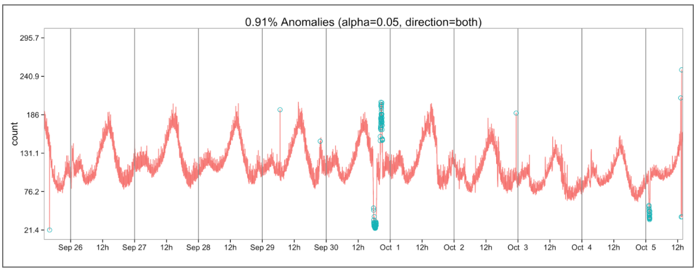

ref: https://github.com/twitter/AnomalyDetection

**Use ETL logs and meta-data to identify records and data anomalies**

*   Detect missing/duplicated data
*   Anomaly detection on patterns and queries types  

_Rationale:_

Data values tend to be stable around some statistics, therefore we could use this statistics to characterize future data and detect potential incident early on the ETL process.

This analysis exploit the nature of data being processed as well as the metadata provided by the ETL tools themselves, to increase the chances of both prediction and detection.

_Objectives:_

*   Monitor the records of specific products or data categories
*   Cluster and group Data Logs specific to given categories and collections
*   Detect Anomalies based on Volume, Query types, error count, log count, time, etc

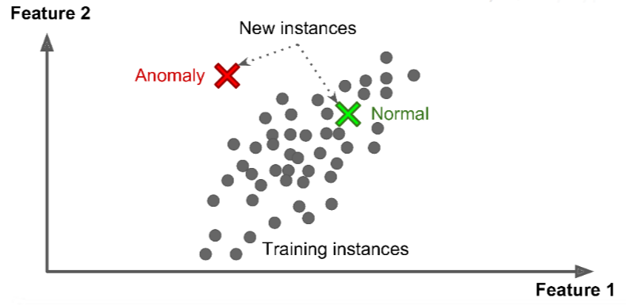

**Use ETL logs and meta-data to cluster and classify queries and data transformations**

Cluster processing based on queries types, query result statuses, access logs, and provide an indication on the "norms" for data and process quality as well as detect possible intrusions and cyber security attacks.

_Rationale:_

ETL metadata, is a rich source of information. Normally this information is manually curated. However metadata is data. And as such it can be processed as text, text extraction techniques can be applied to db logs, query logs and access logs.

Once the data is being structured, machine learning and data science techniques can be applied to detect clusters, and (semi) automatically classifying datasets, providing higher SLA, better data quality, and higher prevention of both incidents as well as cybersec attacks.

_Objectives_

*   Extract patterns and information from machine logs
*   Combine multiple sources
*   Normalize the data into a single format
*   Apply machine learning algorithms to cluster and classify the given information

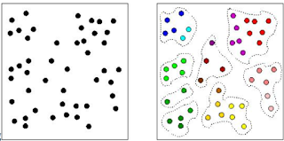

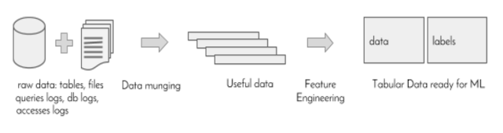

**Data Governance on Streaming Data**

Streaming data is still data. Hence, it must be managed and governed. One way of managing data is by logically partitioning it in semantic layers, from raw data sources to actionable output. In particular, Streaming data can also be layered: from raw events to alerts and notifications.

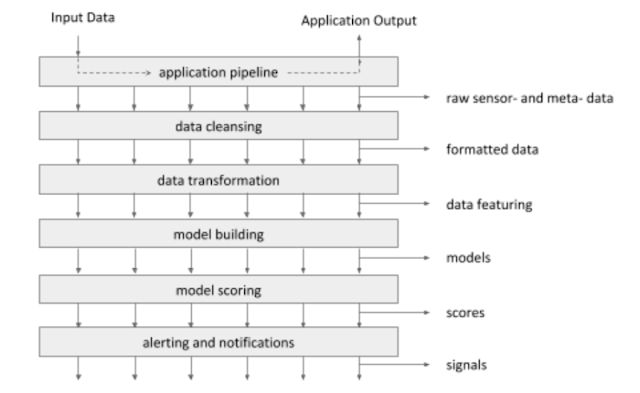

**Streaming Data Components:**

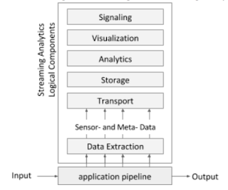

As depicted in the diagram on the right, a streaming analytics, can be logically split three logical function classes:

1.  Data Capture
2.  Data Exploration
3.  Data Exploitation

This can be mapped on 6 logical components:

1.  Data Extraction
2.  Data Transport
3.  Data Storage
4.  Data Analytics
5.  Data Visualization
6.  Data Signaling

**Selection of Streaming Analytics Components**

If we consider the streaming components as a stack, we can select for each component a number of tools available in the market. Therefore, we can define a number of bundles or recipes depending on the technology used for each component of the stack. In the diagram below you can see a fee of those streaming analytics bundles.

Some of those bundles are composed of open source projects, others by proprietary closed-source technologies. This first classification positions technologies such as Splunk, HP, and Teradata, SQLStream in one group and the SMACK, ELK, Flink stacks in another. Moreover, some bundles are fully delivered and maintained by a single company (Splunk, HP Arcsight, Elastic) while others bundles are composed by tools maintained by different companies and dev centers (Teradata, Flink, SMACK).

Also, considering the streaming analytics use cases, some of this bundles are better tuned to specific domains (cyber security, marketing, operational excellence, infrastructural monitoring)  while others are more less specialized and can be tuned or customized to a specific set of use cases.

While the following diagram is not exhaustive, it provides a selection of some of the most bespoken and widely adopted components from streaming analytics as available today in the market.

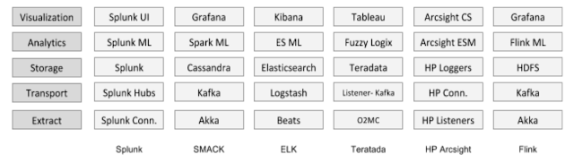

**Scorecard**

The following scorecard can be used to determine which individual components and which bundles are more appropriate and fit-for-purpose provided the use cases, the organization, the capabilities both in terms of people, tools, and technology, the business and financial goals and constraints, and the culture of the given enterprise.

 - Metrics, Criteria
 - Rationale
 - Open Source
   - Sharing the source code, provides a higher level of transparency.
 - Ease of Use
    - How easy it is to implement new use cases? Or to modify existing ones?
  - Vendor Specific
    - Some components, once used might be hard to swap for others  
because of the level of tuning and customization and create technologies lock-ins.
  - Documentation
    - Is the tool well documented? What about, Install, configuration, and examples?
  - Community
    - An active community stimulates and steer the innovation  
process and provides feedback on features, bugs and best practices.
  - Easy of IT Integration
    - How straightforward it is to provide this
  - Longevity
    - The amount of year of the a given technology in the  
market provides an indication of the maturity of the solution.
  - Libraries
    - Are Plugins and 3rd Party Libraries available?  
    - Is there a marketplace, and a community of satellite companies  
contributing to the technology?
  - Maintenance
    - SLA may vary depending of the use case and other requirements
  - Performance
    - How fast are streams processed?  
    - How efficient is the solution provided the same amount of IT resources?
  - Release cycle
    - How often are new releases delivered?
  - TCO
    - What is the estimated total cost of ownership for the selected cpmponents?
  - Data Integration
    - Can the available data sources be directly used?  
    - What about data models and formats?
  - Expertise
    - Are experts available in the job market? Can they be easily acquired?
  - Data Volumes
    - How well can the selected technology cope with the data volumes generated?
  - Learning Curve
    - How much time does it take to master this technology  
from a user/dev/ops perspective?
  - Data Aggregation
    - When models require large context, how well can  
the technology join and merge data?
  - User and Access Management
    - How well does this solution fit to the   
security and auditing measures setup in the enterprise?

**Streaming Meta-Data: Monitoring BI chains**

From a logical architecture perspective, streaming analytics processing can be seen as data transformations or computing step which fetch data from a distributed queue and push results back to the queue, as previously explained on the log-centric conceptual diagram of streaming computing.

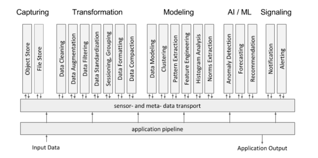

In the previous diagram the logical functions of a streaming analytics systems are divided in groups, depending on the nature of the processing. You could govern streaming analytical functions according to the following taxonomy:  

*   Capturing
    *   Object Store
    *   File Store
*   Data Logging
    *   Data Acquisition via APIs
    *   Data Listeners (files, sockets)
    *   Data Agents (browsers, devices)
*   Transformation
    *   Data Cleaning
    *   Data Augmentation
    *   Data Filtering
    *   Data Standardization
    *   Sessioning, Grouping
    *   Data Formatting
    *   Data Compaction
*   Modeling
    *   Data Modeling
    *   Clustering
    *   Pattern Extraction
    *   Feature Engineering
    *   Histogram Analysis
    *   Norms Extraction
    *   Machine Learning / AI
    *   Anomaly Detection
    *   Forecasting
    *   Recommendation
    *   Classification
*   Signaling  
    *   Alerting
    *   Notification

**Streaming Analytics: Conceptual Architecture**

Before diving in the detailed in the architectural blueprint, let us analyze the main components of such a system. The diagram here below provides a simplified description of the different parts constituting a streaming analytics architecture.

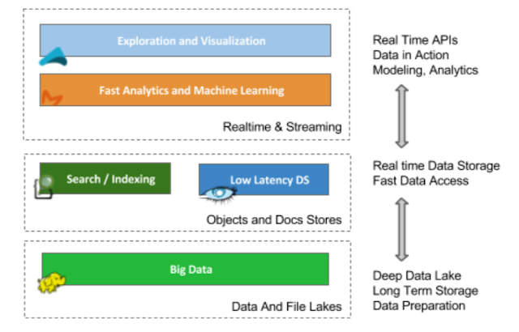

Starting from the bottom, we define two storage layers, the top two layers are analytics, and visualization.  

The first is a typical a Big Data layer for long term storage of data. It provides an excellent and cost efficient solution to store raw stream events and meta-data. Data on this layer is most efficiently stored in large files. This layer is usually not great for random access of specific records, but works well to stream out large files and have them processed in engines such as Presto, Hive, and Spark.

The second storage layer is more tailored toward objects and documents. The characteristic of this layer is that access is fast. This form of storage provides better data search and exploration functions. Moreover, a document store provides fast searches by indexing textual data, and fast access to individual stream events/elements. This layer is typically realized using NoSQL technologies, out of which two of them Cassandra, and Elasticsearch, are discussed in better details in the following sections.

The third layer is meant for model building and data exploration. Presto and Hive are SQL engines part of the Hadoop ecosystem and they are tuned respectively for interactive exploratory queries and large batch analysis on big data volumes. Spark is also an interesting components as it allows to interleave Machine Learning operations with both SQL queries and data transformations using languages such as Scala and Python.

The top layer is populated by data visualization tools. These tools usually access the underlying analytical layer in order to perform the computations, and then display the results using dashboards, graphs and widgets, often via a Web UX.

**Streaming Analytics: Architectural Blueprint and Data Landscape**

The following architectural blueprint, provides a possible implementation for meta-data managements and chain monitoring. It consists of three main parts.

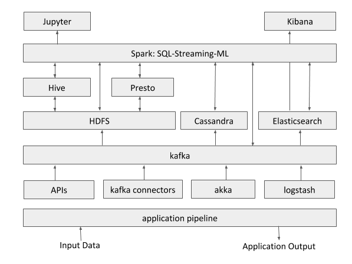

Description:

This open source blueprint serves a number of goals:

*   long term storage of the raw events (data lake)
*   Data exploration and validation of models and hypotheses
*   Implementation and development of ad-hoc  use cases
*   Model creation and model validation using data science and machine learning tools.

**Considerations**

The above blueprint architecture is a possible end state for chain monitoring and operational excellence. It can definitely be phased in stages according to the organization's appetite, roadmap and strategy to streaming analytics and real-time data processing.

One general remark is that each streaming technology and each component of the above blueprint has its "sweet spot" in the overall data landscape.

Elasticsearch is extremely efficient at storing, capturing and display time series data. However because of the way the data is structured complex queries and joins are usually not performed efficiently within this platform. This is way for complex query Elasticsearch can be complemented by other solutions such as Spark, Presto, Hive, Cassandra or other analytical systems such as enterprise data warehouses to act as "powerhouse" for complex queries and aggregation.  

See diagram here below:

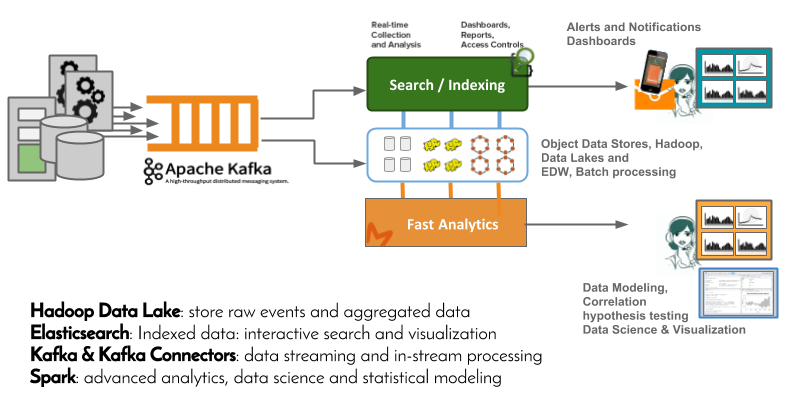

The proposed combination of file and object data stores, topped by Spark is quite powerful and provided probably the highest level of flexibility in order to implement each specific use case, in a tailored and customized way. Spark uniqueness comes from the fact that it provides a unified data programming paradigm. Spark combines SQL, Python, Scala, Java, R, as well as streaming and machine learning capabilities under the same programming paradigm, and using the very same engine to perform this variety of computations.

**Recommendations**

The suggested blueprint requires of course further analysis and it's advised to determine which scoring criteria should weigh more in the selection and determine which components or bundles in the architecture should be prioritized.

It's also probably wise, seen the vast choice of components, tools, libraries and solutions to identify which level of integration (libraries or ready made packaged solutions) is preferred in the organization. Depending on the availability of devops resources, you can trade flexibility, and customized solution for pre-canned use-case specific solutions.  

Active human-manned monitoring is becoming unfeasible, especially when hundreds of dashboards are produced by systems such as Kibana. It's therefore highly recommended to complement the dashboarding approach to a more data-driven solution where patterns and anomalies are learned and detected autonomously by the system.

Also the availability of raw metadata signals as part of this architecture stored in a data lake and transported on kafka will probably constitute a great substrate to create and develop other use case in other domains (fraud, cybersecurity, marketing, personalized recommenders, predictive services etc.)

**Streaming Analytics Engines: Open Source Projects**

For further reading, let's focus on computing engines, as streaming computing engines are the foundation for any domain-specific streaming application. Here below, it's presented a selection of streaming processing technologies which have been developed in the last years:

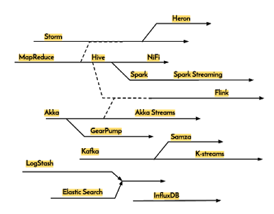

For a detailed description of those technologies, have a look at this post:

[https://www.linkedin.com/pulse/streaming-analytics-story-many-tales-natalino-busa](https://www.linkedin.com/pulse/streaming-analytics-story-many-tales-natalino-busa)  
